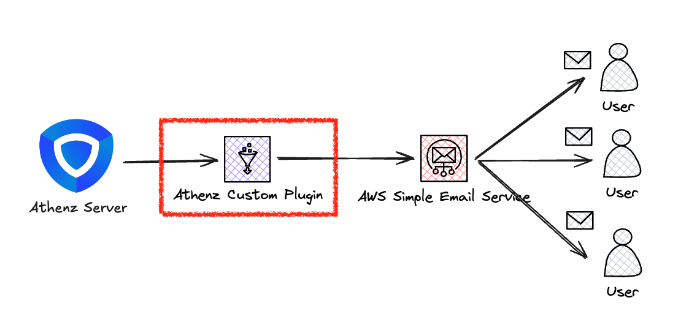

# athenz-amazon-ses-notification-plugin

Athenz custom plugin to send email notifications generated by Athenz server, using [Amazon SES](https://aws.amazon.com/ses/).



# Table of Contents

<!-- TOC -->

- [athenz-amazon-ses-notification-plugin](#athenz-amazon-ses-notification-plugin)
- [Table of Contents](#table-of-contents)
- [Main feature](#main-feature)
- [How to deploy locally](#how-to-deploy-locally)
- [Init this project](#init-this-project)
  - [Read the official documentation.](#read-the-official-documentation)
  - [How I first created this project.](#how-i-first-created-this-project)
  - [Import latest](#import-latest)
  - [Write codes](#write-codes)
  - [Build code](#build-code)
  - [Create k8s cm based on the jar](#create-k8s-cm-based-on-the-jar)

<!-- /TOC -->

# Main feature

🟡 TODO: Make a PR for a gif to show this feature!

# How to deploy locally

```sh
make
```

# Init this project

Here is a step-by-step guide on how I created this project.

## Read the official documentation.

https://athenz.github.io/athenz/email_notifications/#enable-notifications-using-other-providers

## How I first created this project.

This plugin is created with the interface defined here: https://github.com/AthenZ/athenz/blob/f9c9959338ca293c723d60b756f3187dd7e70942/libs/java/server_common/src/main/java/com/yahoo/athenz/common/server/notification/NotificationService.java#L22


## Import latest

```sh
mvn clean install -U
```

## Write codes

I wrote the following code: https://github.com/mlajkim/athenz-amazon-ses-notification-plugin/pull/1

## Build code

File is created in `target/ses-notification-plugin-1.0.0.jar`:

```sh
mvn clean package

# Lots of log ...
# [INFO] ------------------------------------------------------------------------
# [INFO] BUILD SUCCESS
# [INFO] ------------------------------------------------------------------------
# [INFO] Total time:  5.805 s
# [INFO] Finished at: 2026-01-05T13:54:14+09:00
# [INFO] ------------------------------------------------------------------------
```

## Create k8s cm based on the jar

> [!TIP]
> We cannot do `--dry-run` as k8s stores records in binary, and they do not allow such a long one so we can only create:

```sh
kubectl delete cm ses-plugin-lib -n athenz
kubectl create configmap ses-plugin-lib \
  --from-file=ses-plugin.jar=target/ses-notification-plugin-1.0.0.jar \
  -n athenz
kubectl rollout restart deployment athenz-zms-server -n athenz

# configmap/ses-plugin-lib configured
# deployment.apps/athenz-zms-server restarted
```